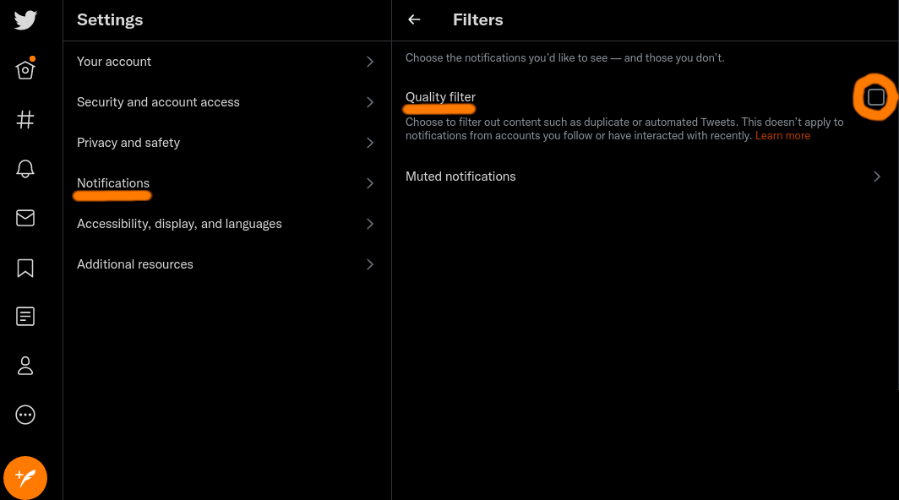

<p align="center">
  
  <h1 align="center">Pseudbot</h1>
</p>

<p align="center">
  <a href="https://developer.twitter.com/en/docs/twitter-api/v1">
    
  </a>
  <a href="https://github.com/psf/black">
    
  </a>
  <a href="./LICENSE">
    
  </a>
  <a href="https://www.tweepy.org/">
    
  </a>
</p>

<p align="center">
  *A friendly bot* 🤖*created by Rick Sanchez* 🧪 *from dimension C-137* 🌎*.*
</p>

📣 Mention it in a 🗐 thread 🪡🧵 and it'll 🗨 reply 🗣 to the 🚸 parent
🗮 tweet 🕊 with a Rick 🧠 and Morty 😜 quote 💯 in two minutes 🕓 or
less (if it's online 🖧).

It picks up right where it left off in its mentions when it reboots ♻.

> **"***As a reflection of my true and honest nihilistic outlook,<br>we're building a machine;<br>we're taking a wrench to the discourse!<br>Metaphorical cocks in the machine, if you will.***"**

⚞***R&M♾100Y!***⚟

## Installation
The sections under here that follow are the current installation steps.
In the future, the *Set up your Python environment* section will
become optional.

### Get access to the Twitter API
Before doing anything else,
[apply for access](https://developer.twitter.com/en/docs/twitter-api/getting-started/getting-access-to-the-twitter-api)
to the Twitter API.  For this app, the "Standard" product track for
individual/hobbyist use *should* be more than sufficient for a Pseudbot
installation.

It is recommended to use a dedicated Twitter account for your Pseudbot
instance (unless you don't mind clogging up your followers' notifications, of
course).

Once you have gotten access to the Twitter API, you can begin setting up
Pseudbot.

### Install your API keys
Create a file named `pseud.json` with your editor and paste in the API keys you
just created on Twitter's developer page in the previous step:
```json
{
  "consumer": "key goes here",
  "consumer_secret": "key goes here",
  "bearer_token": "key goes here",
  "tok": "key goes here",
  "tok_secret": "key goes here"
}
```

### Set up your Python environment (recommended for now)
Currently only use in a `venv` within this repository's root directory
is tested and supported.  Most things should work outside of a `venv`, but
you'll have to be mindful of where your config and `last_id` files are.

Set up your Python virtual environment (a `venv`, in this case):
```
$ python3 -m venv .venv
```

Activate the `venv` by sourcing the appropriate `activate` for your running
shell:
```
$ . .venv/bin/activate
```

### Install Pseudbot
Install the bot by running its `setup.py` via Pseudbot's `Makefile`:
```
$ make install
```

If everything worked out okay, you should now have the `pseudbot` command
within your shell's search path.


## Testing your API keys
You can send a test tweet from `pseudbot` by running the `hello` action:
```
$ pseudbot hello
    ⠀⠀⠀⠀⠀⠀⠀⠀⠀⠀⠀⠀⠀⠀⠀⠀⠀⠀⠀⠀⠀⠀⢀⡤⠶⢶⣶⣦⣄⡀⠀⠀
    ⠀⠀⠀⠀⠀⠀⠀⠀⠀⠀⠀⠀⠀⠀⠀⠀⠀⠀⠀⠀⠀⣠⣾⣿⡄⠒⠪⢝⠻⣿⣿⣦⡀
    ⠀⠀⠀⠀⠀⠀⠀⠀⠀⠀⠀⠀⠀⠀⠀⠀⠀⠀⠀⠀⣴⣿⡿⢉⡀⠀⠈⠐⠄⢿⣿⣿⣷
    ⠀⠀⠀⠀⠀⠀⠀⠀⠀⠀⠀⠀⠀⠀⠀⠀⠀⠀⠀⣼⣿⡇⠀*⠈⡄⠤⢀⠈⣾⣿⣿⣿
    ⠀⠀⠀⠀⠀⠀⠀⠀⠀⠀⠀⠀⠀⠀⠀⠀⠀⢀⡾⣿⣟⣕⡤⡠⠘⠀*⠀⢱⣿⣿⣿⣿
    ⠀⠀⠀⠀⠀⠀⠀⠀⠀⠀⠀⠀⠀⠀⠀⠀⢠⣾⣾⣿⣞⣄⠮⠔⠈⡢⠄⣠⣾⣿⣿⣿⣿
    ⠀⠀⠀⠀⠀⠀⠀⠀⠀⠀⠀⠀⠀⠀⠀⠠⢿⣿⢽⡻⣿⣿⣿⣽⣵⣾⡽⣿⣿⣿⣿⣿⡏
    ⠀⠀⠀⠀⠀⠀⠀⠀⠀⠀⠀⠀⠀⠀⢠⣗⣿⡟⠈⠉⠚⢽⣻⢷⡝⣿⡿⣿⣿⣿⣿⡿⠀
    ⠀⠀⠀⠀⠀⠀⠀⠀⠀⠀⠀⠀⠀⢠⣿⣿⣿⠇⠀⠀⠀⠀⠀⢩⣯⣭⣾⣿⣿⣿⣿⠁⠀
    ⠀⠀⠀⠀⠀⠀⠀⠀⠀⠀⠀⠀⣰⣿⣿⣿⠃⠀⠀⠀⠀⠀⣰⣿⣿⣿⣿⣿⣿⣿⠃⠀⠀
    ⠀⠀⠀⠀⠀⠀⠀⠀⠀⠀⠀⣴⣿⣿⡿⠃⠀⠀⠀⠀⣠⣼⣿⣿⣿⣿⣿⣿⣿⠃⠀⠀⠀
    ⠀⠀⠀⠀⠀⠀⠀⠀⠀⢀⢞⣿⣿⡿⠁⠀⠀⠀⣠⣾⣿⣿⣿⣿⣿⣿⣿⣿⠃⠀⠀⠀⠀
    ⠀⠀⠀⠀⠀⠀⠀⠀⣰⣿⣾⣿⠏⠀⠀⠀⠀⣾⣿⣿⣿⣿⣿⣿⡟⣿⣿⠏⠀⠀⠀⠀⠀
    ⠀⠀⠀⠀⠀⠀⣠⣾⣿⣿⣿⠃⠀⠀⠀⠀⣸⣿⣿⣿⣿⣿⣟⣷⣾⣿⠏⠀⠀⠀⠀⠀⠀
    ⠀⠀⠀⠀⢀⣾⣿⣿⣿⣿⠃⠀⠀⠀⢀⣴⣿⣿⣿⣿⣿⣿⣿⣿⣿⠋⠀⠀⠀⠀⠀⠀⠀
    ⠀⠀⠀⡰⢿⣿⣿⣯⡶⠁⠀⠀⢀⣴⣿⣿⣿⣿⣿⣿⣿⣿⣿⡿⠃⠀⠀⠀⠀⠀⠀⠀⠀
    ⠀⢀⣼⣟⣿⣿⡿⠃⠀⠀⢀⣴⣿⣿⣿⣿⣿⣿⣿⣿⣿⣿⡟⠁⠀⠀⠀⠀⠀⠀⠀⠀⠀
    ⢀⣾⣿⣿⡯⣿⠀⠀⢠⣴⣿⣿⣿⣿⣿⣿⣿⣿⣿⣿⣿⠏⠀⠀⠀⠀⠀⠀⠀⠀⠀⠀⠀⠀⠀
    ⣾⣿⣿⣿⣿⣿⣶⣶⣿⣿⣿⣿⣿⣿⣿⣿⣿⣿⣿⡿⠁⠀⠀⠀⠀⠀⠀⠀⠀⠀⠀⠀⠀
    ⠿⣿⡿⣿⣿⣿⣿⣿⣿⣿⣿⣿⣿⣿⣿⣿⢿⡿⠋⠀⠀⠀⠀⠀⠀⠀⠀⠀⠀⠀⠀⠀⠀
    ⠀⠛⠀⠈⠀⠻⣿⣿⣿⣿⣿⣟⣛⣿⣿⡭⠋⠀⠀⠀⠀⠀⠀⠀⠀⠀⠀⠀⠀⠀⠀⠀⠀
    ⠢⡀⠀⠀⠀⠀⠻⣿⣿⣿⣿⣿⣭⠟⠉⠀⠀⠀⠀⠀⠀⠀⠀⠀⠀⠀⠀⠀⠀⠀⠀⠀⠀
    ⠀⠈⠐⠤⢀⡀⠀⢀⣙⣿⠿⠋⠁⠀⠀⠀⠀⠀⠀⠀⠀⠀⠀⠀⠀⠀⠀⠀⠀⠀⠀⠀⠀

___
 |   _.._ _     _ ._   _._ _  _..__|_
_|_ (_|| | | \/(/_|\/ _>| | |(_||  |_
                   /

[TWEET]: "🕑1635207388: Running method: "hello"" (https://twitter.com/pseudbot/status/1452791284683481092)
[TWEET]: "🕑1635207388: Hello pseudbot" (https://twitter.com/pseudbot/status/1452791287623700481)
```

If `hello` ran without any errors and the parenthesized URLs work, you can move
on to actually running the bot!

## Running the bot
In a long-lived shell session, start your Pseudbot instance with the `run_bot`
action:
```
$ pseudbot run_bot
...
[TWEET]: "Powered on at 1635208674" (https://twitter.com/pseudbot/status/1452796682056388618)
[TWEET]: "@SoloDeath1 This copypasta was never even funny to begin with. I've never even seen the show, and it was obviously a joke. What kind of idiot do you have to be to think that was ever said seriously?" (https://twitter.com/pseudbot/status/1452748584877711367)
[TWEET]: "@pseudbot But it makes fun of something which is popular, and therefore popular to shit on among the contrarians on Reddit. Come on, really. I actually do have to wonder about the IQs of people who like that pretentious copypasta." (https://twitter.com/pseudbot/status/1452748594449158146)
[TWEET]: "@pseudbot You know, I sometimes can't help but superiorly smirk as I imagine their dumb faces struggling to understand words on a mere internet webpage." (https://twitter.com/pseudbot/status/1452748603978616842)
[TWEET]: "@pseudbot In fact, I sometimes find myself in paroxysms of ironic Schadenfreude as I envision the visages of the aforementioned Slow-in-the-minds waging war with the Cultural Artifact they proclaim to be analyzing," (https://twitter.com/pseudbot/status/1452748613466140679)
[TWEET]: "@pseudbot only to fall, slack-jawed, back into their insensate stupor, the proverbial Undiscovered Country, "from whose bourn no traveler returns" ." (https://twitter.com/pseudbot/status/1452748623075287051)
Finished chain with 1452748623075287051
```

If you installed the bot in a `venv`, make sure you've activated your `venv` in
your current shell before starting the bot (rerun the `activate` command
mentioned above in *Set up your Python environment*).

### A note about mentions
If you want the bot to respond to mentions from accounts it isn't following,
go to your bot account's
[notification filter settings page](https://twitter.com/settings/notifications/filters)
and *uncheck* the `Quality filter` ☑ checkbox:


### Shutting down the bot
To shut down your bot, simply send the keyboard interrupt signal (usually by
pressing `Ctrl`**+**`C` on your keyboard):
```
...
[TWEET]: "@pseudbot 🥒 IM PIIICKLE 🥒 RIIIIIICK!!! 😂 👌 💯 🥒 IM PIIICKLE 🥒 RIIIIIICK!!! 😂 👌 💯 🥒 IM PIIICKLE 🥒 RIIIIIICK!!! 😂 👌 💯" (https://twitter.com/pseudbot/status/1452754226820571148)
Finished chain with 1452754226820571148
^C
[TWEET]: Tweeted "Shut down for maintenance at 1635208498" (https://twitter.com/pseudbot/status/1452795944324550659)
```

The next time you restart your bot, it will resume where it left off using the
`last_id` file.
